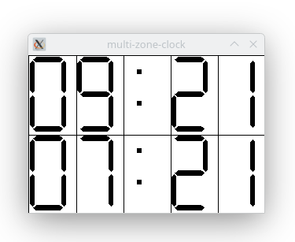

## 7 segment digit widget for X Windows
This project contains the implementation of a 7 segment display widget.

There is a test program called "xdigits" which uses 5 of these widgets to implement 
a simple digital clock.

There is another test program called "multi-zone-clock" which shows time values for
multiple time zones. Currently, "multi" means 2, showing local time and GMT time.

## Build
```shell
make clean; make
```

## Run xdigit clock program
```shell
./xdigit
```

The xdigit clock looks like this:


## Run multi-zone-clock program
```shell
./multi-zone-clock
```

The multi-zone-clock looks like this:



## The definition of a digit
The resource XtNvalue controls the digit to be displayed. The value corresponds to 
the displayed number, except the following values:
* MINUS_VALUE : minus (segment 4)
* DECPOINT_VALUE : decimal point only (segment 8)
* DOUBLEPOINT_VALUE : double point (segments 9,10)

```
    origin
   *----------------+	+ segment_margin      *---------+   +
   | 1------------2 |	+                     |   /\0   |   |
   | /            \ |                         | 5|  |1  |   |
   | \0          3/ |                         |  |  |   |   segment_height
   | 5------------4 |                         |  |  |   |   |
   +----------------+                         | 4|  |2  |   |
   +-+ segment_margin                         |   \/3   |   |
   ++ segment_delta                           +---------+   +
                                              +---------+ segment_width 
```

Segment numbers:
``` 
        --1--
       |     |
       2 -9- 3
       |--4--|
       5 -*- 6 (*=10)
       |     |
        --7--  -8-
```

## further reading
* ctime, gmtime and such functions - https://man7.org/linux/man-pages/man3/ctime.3.html
