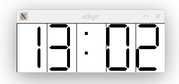
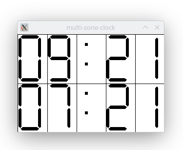
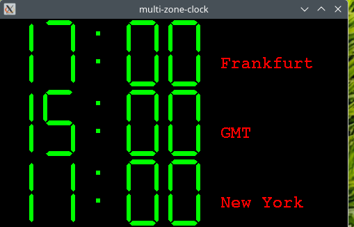
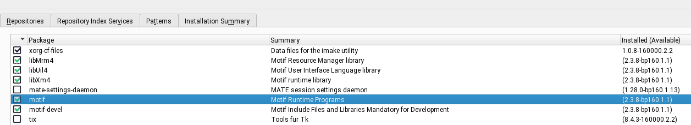

## 7 segment digit widget for X Windows
This project contains the implementation of a 7 segment display widget.

There is a test program called "xdigits" which uses 5 of these widgets to implement 
a simple digital clock.

There is another test program called "multi-zone-clock" which shows time values for
multiple time zones. 

This code uses Xt, XLib and OSF/Motif library, which should be contained or at least installable via package
from common Linux installations. These libraries are very old, and they will work even on Retro hardware (like
my SUN Sunblade 100).

## Build
Generate Makefile using xmkmf/imake:
```shell
-bash-5.3$ xmkmf
mv -f Makefile Makefile.bak
imake -DUseInstalled -I/usr/local/lib/X11/config
```

Build lib and executables:
```shell
make clean; make
```

## Run xdigit clock program
```shell
./xdigit
```

The xdigit clock looks like this:



## Run multi-zone-clock program
```shell
./multi-zone-clock
```

The multi-zone-clock looks like this:



For pretty colors see below in resources section.

## Load resources with xrdb
```shell
# list existing definitions
xrdb --query
# add local ressources
xrdb --merge Digit.ad
```

Example content of Multi-zone-clock.ad:
```shell
multi-zone-clock*Digit.value: 0
multi-zone-clock*Digit.showDecimalPoint: False
multi-zone-clock*Digit.background: black
multi-zone-clock*Digit.foreground: green

multi-zone-clock*clockPanel.background: black

multi-zone-clock*clockTitle.background: black
multi-zone-clock.clockPanel.clockTitle.foreground: red

multi-zone-clock.clocks: Frankfurt=Local,GMT=GMT,New York=America/New_York
```

Example result:



## Install Motif libs+includes (OpenSuse)
Using default OpenSuse packaging tooling, the following libs are needed for OSF/Motif:



## Details on implementation

### The definition of a digit
The resource XtNvalue controls the digit to be displayed. The value corresponds to 
the displayed number, except the following values:
* MINUS_VALUE : minus (segment 4)
* DECPOINT_VALUE : decimal point only (segment 8)
* DOUBLEPOINT_VALUE : double point (segments 9,10)
* NO_VALUE : no segments and no decimal point are displayed

A number is displayed by drawing all required segments for that number.
Segment indices:
``` 
        --1--
       |     |
       2 -9- 3
       |--4--|
       5 -*- 6 (*=10)
       |     |
        --7--  -8-
```

Each segment is drawn as a filled polygon of five points, starting with
point index 0. Below are the points for horizontal and vertical segments:

Horizontal:
```
   origin
   *----------------+	+ segment_margin    +
   | 1------------2 |   +                   |                     
   | /            \ |                       | segment_height                      
   | \0          3/ |                       |
   | 5------------4 |                       |
   +----------------+                       +
                  +-+ segment_margin  
    ++ segment_delta   
   +<-segmentwidth->+
```

Vertical:
```
                         origin
   + segment_margin      *---------+   +
   +                     |   /\0   |   |
                         | 5|  |1  |   |
                         |  |  |   |   segment_height
                         |  |  |   |   |
                         | 4|  |2  |   | +
                         |   \/3   |   | + segment_delta
                         +---------+   +
                         +--+ segment_margin
                         +---------+ segment_width 
```
segment_height and segment width is outer box for segment drawing.
segment_margin is the minimum distance between outer box and polygon for segment area, both in x and y dimension. 
segment_delta is the horizonal distance between point 0 and 1.

### Loading fonts in X Windows (Motif)
List all available X Font names with 
```shell
xlsfonts
```
See also own file ```listfonts.c``` .

To use a font, we need to load it. The font can be loaded by
```c++
#define SOMEFONT "-adobe-courier-bold-r-normal--24-240-75-75-m-150-iso8859-1"

char *someFont = SOMEFONT;
XFontStruct *font_info = XLoadQueryFont(display, someFont);
```

Then we need to set the font for the widget.

Motif does it slightly different that pure Xt. To set a font for a widget,
we need to use the resource named ```XmNfontList```. 

First create a font list from the font:
```c++
XmFontList fontList = XmFontListCreate(font_info, XmFONTLIST_DEFAULT_TAG);
```

Then use it when creating the widget:
```c++
Arg wargs[7];
int n=0;

XmString xmstr = XmStringCreate(title, XmSTRING_DEFAULT_CHARSET);

XtSetArg( wargs[n], XmNlabelString, xmstr ); n++;
XtSetArg( wargs[n], XmNfontList, font_list ); n++;
// more resource setting removed ... 
XtCreateManagedWidget("clockTitle", xmLabelWidgetClass, compo, wargs, n);
```

### Setting colors in widgets
Get existing values like seen below.

Define some structures to receive the values:
```c++
typedef struct _Resources {
	Pixel foreground;
	Pixel background;
} Resources;

static Resources theResources;

static XtResource resourceSpec[] = {
	{ XtNforeground, XtCForeground, XtRPixel, sizeof(Pixel),
	  XtOffsetOf(Resources, foreground),
	  XtRString, "XtDefaultForeground"},
	{ XtNbackground, XtCBackground, XtRPixel, sizeof(Pixel),
	  XtOffsetOf(Resources, background),
	  XtRString, "XtDefaultBackground"},
};
```

And the function call to fill these structures:
```c++
XtGetApplicationResources(toplevel, &theResources,
			   resourceSpec, XtNumber(resourceSpec), NULL, 0);
```

Use resources in Widget args:
```c++
XtSetArg( wargs[n], XtNforeground, theResources.foreground /*XtDefaultForeground*/ ); n++;
XtSetArg( wargs[n], XtNbackground, theResources.background ); n++;
```

## Further reading
* ctime, gmtime and such functions - https://man7.org/linux/man-pages/man3/ctime.3.html
* Xt fonts and fontsets - https://ftp.zx.net.nz/rom/V4.0Fr1229_D1/DOCS/HTML/AQ0R4DTE/CRTGCHXX.HTM
* Xt Intrinsics manual - https://ftpmirror.your.org/pub/misc/bitsavers/pdf/hp/9000_hpux/x11/98794-90008_Programming_With_the_Xt_Intrinsics_Sep89.pdf
* Motif infos - https://en.wikipedia.org/wiki/Motif_(software)